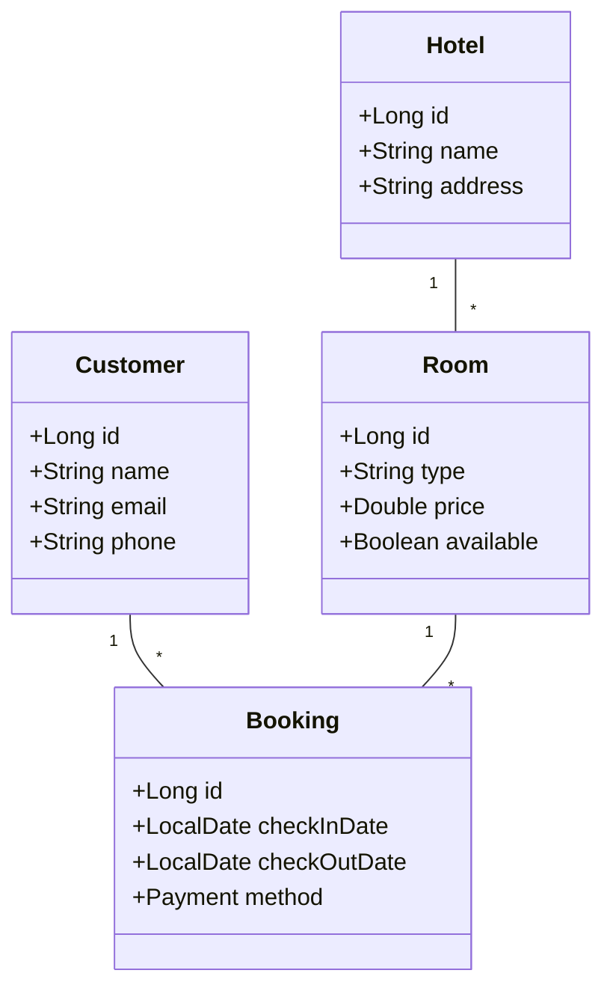

# Projeto-Hotel-Dio
Java restful API
## Diagrama De Classes

```mermaid
classDiagram
    class Hotel {
        +Long id
        +String name
        +String address
    }

    class Room {
        +Long id
        +String type
        +Double price
        +Boolean available
    }

    class Customer {
        +Long id
        +String name
        +String email
        +String phone
    }

    class Booking {
        +Long id
        +LocalDate checkInDate
        +LocalDate checkOutDate
        +Payment method 
    }

    Hotel "1" -- "*" Room
    Customer "1" -- "*" Booking
    Room "1" -- "*" Booking

```
